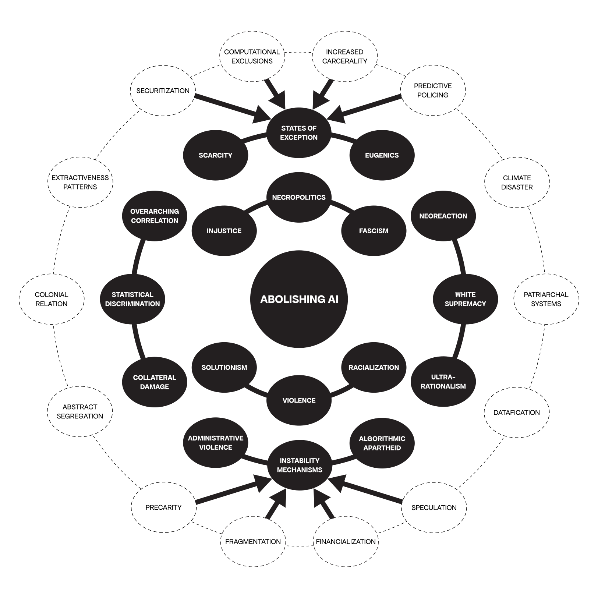
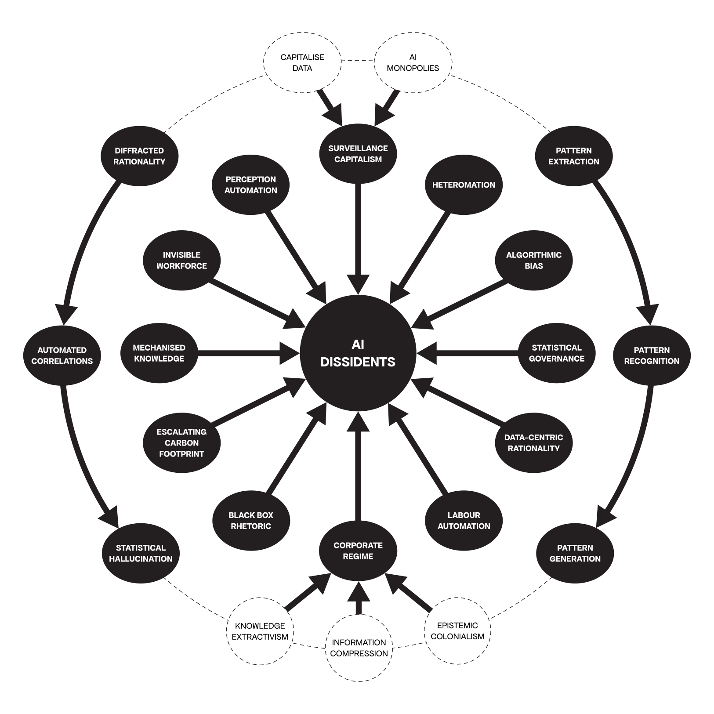
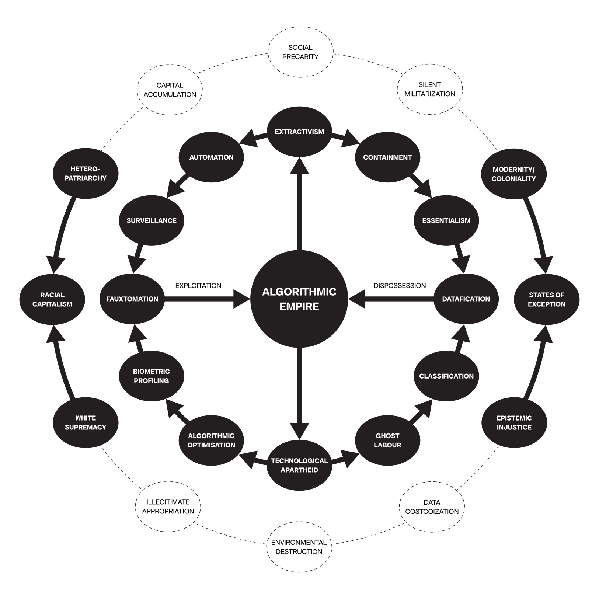
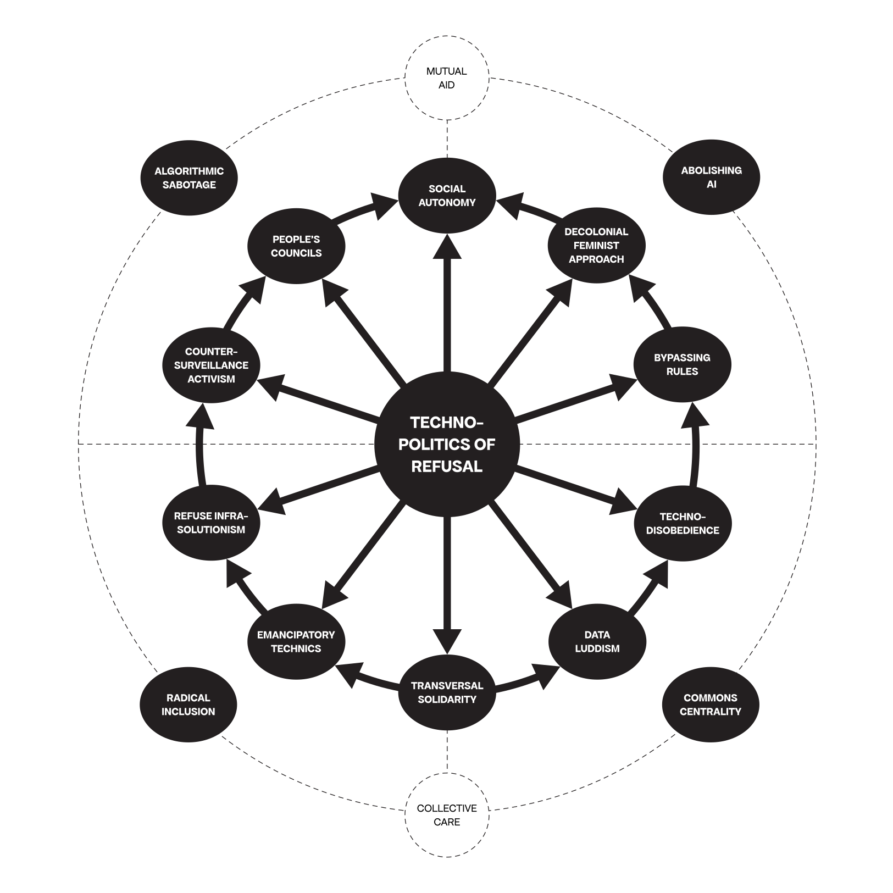
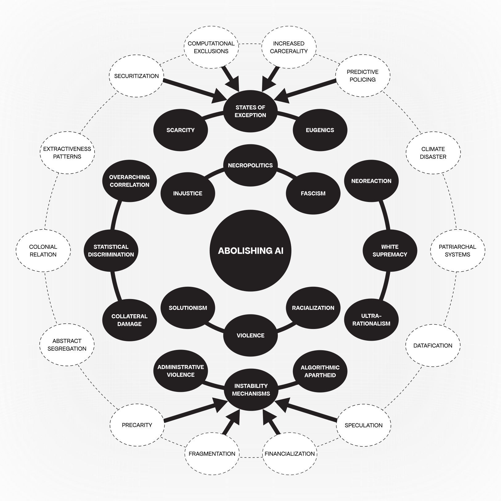
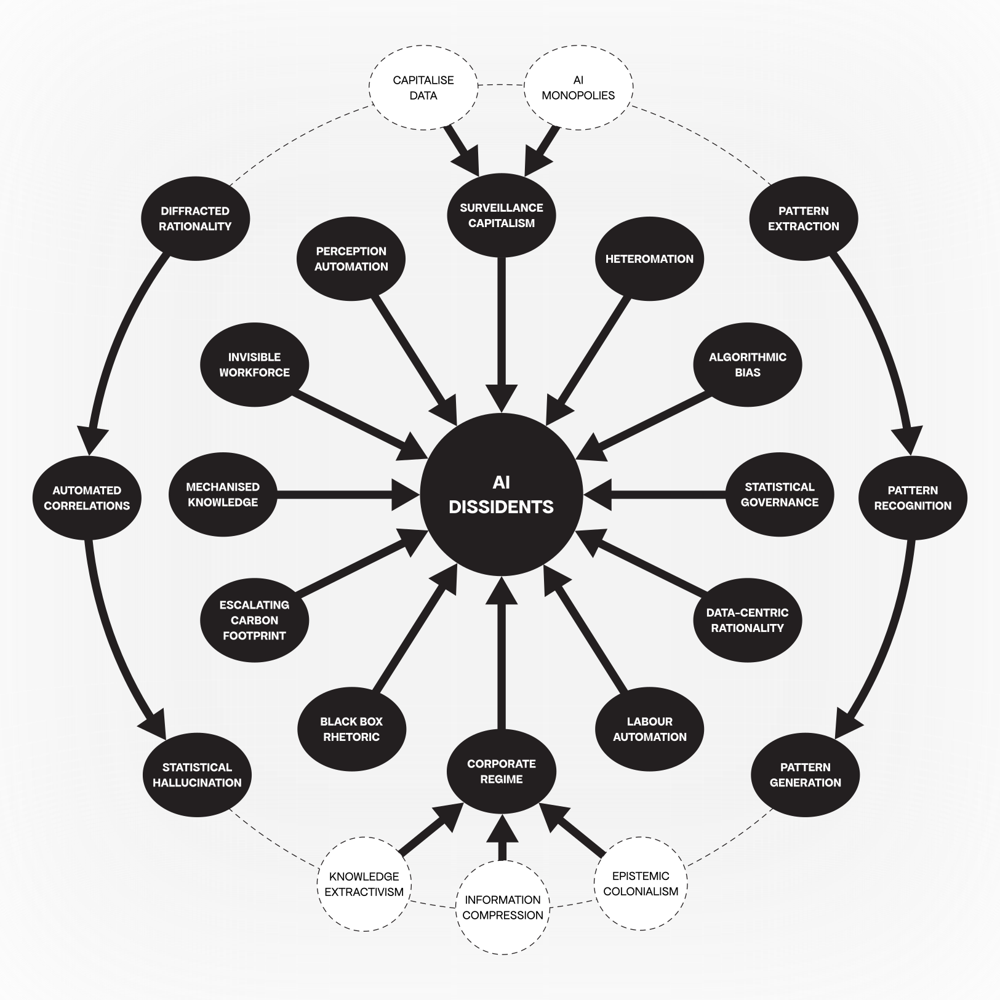
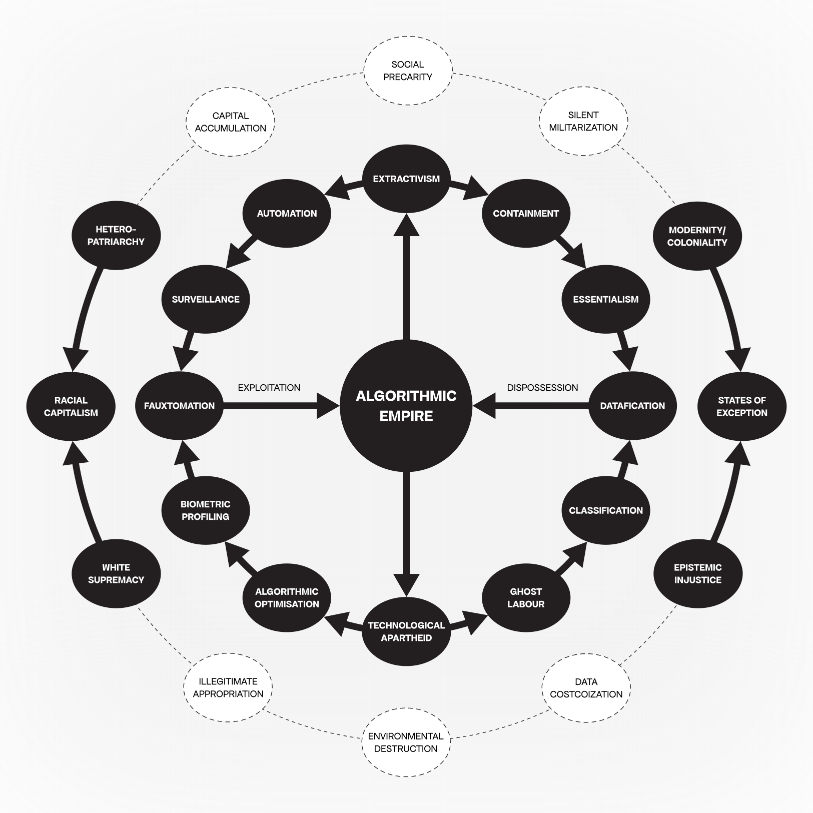
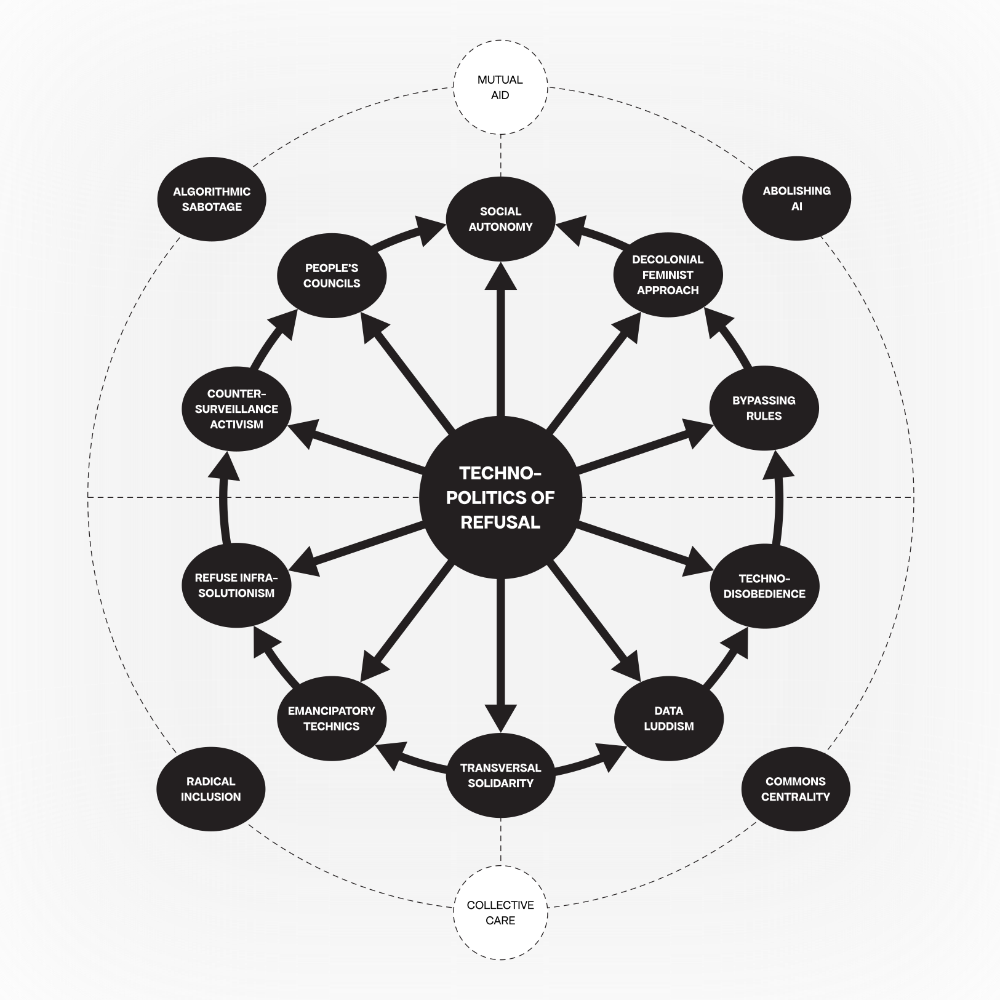



 

<--->



 

<--->



## Context

The Algorithmic Sabotage Research Group (ASRG) has drawn a series of intertwined feedback loops that unfold from several interrelated briefs for intellectual and practical exploration. These critically subversive flowcharts have been informed by research on digital labour exploitation, invisible infrastructures, techno-colonialism, automatised technologies of tracking, monitoring and surveillance and many other contemporary phenomena at the intersection between technology and society.

### Intertwined Feedback Loops 

**ABOLISHING AI**

_A preliminary version of an intertwined feedback loop that illustrates the multiplicity of AI's harms and its irrevocable entanglement with various registers of violence._

<strong>“Abolishing AI”</strong> | A preliminary version of an intertwined feedback loop that illustrates the multiplicity of AI's harms and its irrevocable entanglement with various registers of violence | Diagram: © Algorithmic Sabotage Research Group


**Note** 
Download the diagram as a PDF: https://cryptpad.fr/file/#/2/file/ts0tiWAKkphB5yhEkd3bEhDv/.


***

**AI DISSIDENTS**

_An intertwined feedback loop that presents the limits and mystifications of AI within the framework of “Algorithmic Empire”._

<strong>“AI Dissidents”</strong> | An intertwined feedback loop presents the limits and mystifications of AI within the framework of “Algorithmic Empire” | Diagram: © Algorithmic Sabotage Research Group


**Note** 
Download the diagram as a PDF: https://cryptpad.fr/file/#/2/file/xoK2qrqbuUwwV57HfVk12HVi/.


***

**ALGORITHMIC EMPIRE**

_A visual representation of the framework of “Algorithmic Empire”, situating its roots, mechanisms and practices._

<strong>“Algorithmic Empire”</strong> | An intertwined feedback loop of mechanisms, roots and practices that outlines the concept of “Algorithmic Empire” | Diagram: © Algorithmic Sabotage Research Group


**Note** 
Download the diagram as a PDF: https://cryptpad.fr/file/#/2/file/Xfn7sBZ8sBdeJhEDaPswn-Ik/.


***

**TECHNOPOLITICS OF REFUSAL**

_An intertwined feedback loop between technopolitics of refusal, strategies of disruption and possibilities of resistance in “Algorithmic Empire”._

<strong>“Technopolitics of Refusal”</strong> | An intertwined feedback loop between technopolitics of refusal, strategies of disruption and possibilities of resistance in “Algorithmic Empire” | Diagram: © Algorithmic Sabotage Research Group


**Note** 
Download the diagram as a PDF: https://cryptpad.fr/file/#/2/file/91HNffEZrvcMZaILzbcA5yWO/.


***

## Supplemental Information

### Preliminary Reading List

- Crawford, K. and Paglen, T. (2019) Excavating AI: The Politics of Images in Machine Learning Training Sets, excavating.ai. Available at: https://excavating.ai/.

- Ekbia, H. and Nardi, B. (2017) Heteromation, and other stories of computing and capitalism. The MIT Press.

- Mcquillan, D. (2015) Data Luddism, danmcquillan.org. Available at: https://danmcquillan.org/dataluddism.html.

- McQuillan, D. (2018) People’s Councils for Ethical Machine Learning. Available at: https://journals.sagepub.com/doi/full/10.1177/2056305118768303.

- McQuillan, D. (2022). Resisting AI. Available at: https://doi.org/10.51952/9781529213522.

- Pasquinelli, M. (2023) The Automation of General Intelligence, Journal #141. Available at: https://www.e-flux.com/journal/141/577253/the-automation-of-general-intelligence/.

- Pasquinelli, M. and Joler, V. (2021) The nooscope manifested: AI as instrument of knowledge extractivism, AI & society. Available at: https://www.ncbi.nlm.nih.gov/pmc/articles/PMC7680082/.
 
- Tacheva, J., & Ramasubramanian, S. (2023). AI Empire: Unraveling the interlocking systems of oppression in generative AI’s global order. Big Data & Society, 10(2). Available at: https://journals.sagepub.com/doi/10.1177/20539517231219241.
 
- Woodcock, J. (2021) Towards a digital workerism: Workers’ inquiry, methods, and Technologies - NanoEthics, SpringerLink. Available at: https://link.springer.com/article/10.1007/s11569-021-00384-w.

