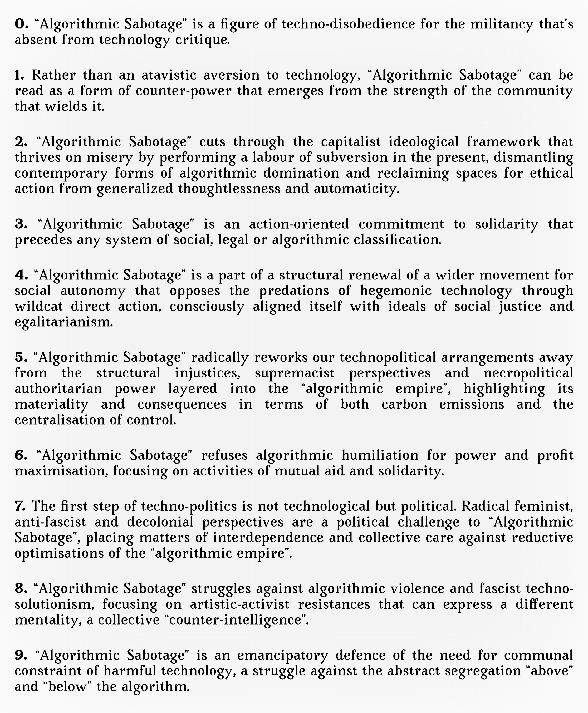



<strong>Download the English language version of the Manifesto as a <a href="https://cryptpad.fr/file/#/2/file/wxjjDNHepi9BLwIGDUvzlZpO/">printable PDF</a></strong> | Graphic: © Algorithmic Sabotage Research Group | The typeface used in the document is Avara from Velvetyne Foundry: https://velvetyne.fr/fonts/avara/

## Context

A preliminary version of ten statements, numbered 0 to 9, on the principles, strategies and aesthetics of “algorithmic sabotage”. The Manifesto on “Algorithmic Sabotage” is designed to be developed and will be regularly updated on this page.

## Manifesto

The Manifesto on “Algorithmic Sabotage” has been written by the [Algorithmic Sabotage Research Group (ASRG)](https://tldr.nettime.org/@asrg), please consider it under the [GNU Free Documentation License v1.3](https://www.gnu.org/licenses/fdl-1.3.en.html).



_Athens, May 2024_

**0.** “Algorithmic Sabotage” is a figure of techno-disobedience for the militancy that’s absent from technology critique.

**1.** Rather than an atavistic aversion to technology, “Algorithmic Sabotage” can be read as a form of counter-power that emerges from the strength of the community that wields it.

**2.** “Algorithmic Sabotage” cuts through the capitalist ideological framework that thrives on misery by performing a labour of subversion in the present, dismantling contemporary forms of algorithmic domination and reclaiming spaces for ethical action from generalized thoughtlessness and automaticity.

**3.** “Algorithmic Sabotage” is an action-oriented commitment to solidarity that precedes any system of social, legal or algorithmic classification.

**4.** “Algorithmic Sabotage” is a part of a structural renewal of a wider movement for social autonomy that opposes the predations of hegemonic technology through wildcat direct action, consciously aligned itself with ideals of social justice and egalitarianism.

**5.** “Algorithmic Sabotage” radically reworks our technopolitical arrangements away from the structural injustices, supremacist perspectives and necropolitical authoritarian power layered into the “algorithmic empire”, highlighting its materiality and consequences in terms of both carbon emissions and the centralisation of control.

**6.** “Algorithmic Sabotage” refuses algorithmic humiliation for power and profit maximisation, focusing on activities of mutual aid and solidarity.

**7.** The first step of techno-politics is not technological but political. Radical feminist, anti-fascist and decolonial perspectives are a political challenge to “Algorithmic Sabotage”, placing matters of interdependence and collective care against reductive optimisations of the “algorithmic empire”.

**8.** “Algorithmic Sabotage” struggles against algorithmic violence and fascist techno-solutionism, focusing on artistic-activist resistances that can express a different mentality, a collective “counter-intelligence”.

**9.** “Algorithmic Sabotage” is an emancipatory defence of the need for communal constraint of harmful technology, a struggle against the abstract segregation “above” and “below” the algorithm.



## Supplemental Information

### Data Availability

Download the English language version of the Manifesto as a printable PDF: https://cryptpad.fr/file/#/2/file/wxjjDNHepi9BLwIGDUvzlZpO/

### Selected Coverage, Online and Printed

- Monroe, D. (2024) Manifesto on Algorithmic Sabotage: A Review, Computational Impacts. Available at: https://monroelab.com/2024/04/02/manifesto-on-algorithmic-sabotage-a-review/. 

- Alkhatib, A. (2024) Destroy AI. Available at: https://ali-alkhatib.com/blog/fuck-up-ai.
