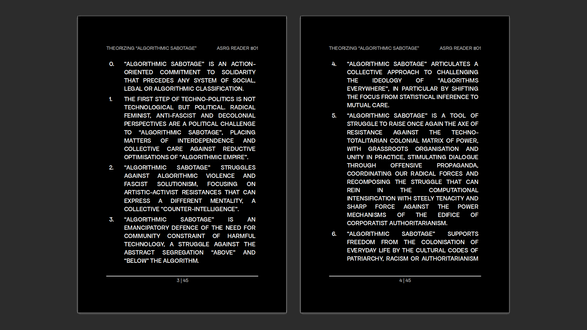
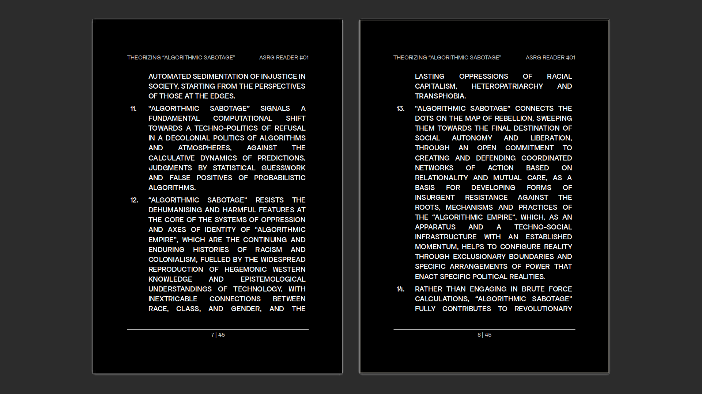
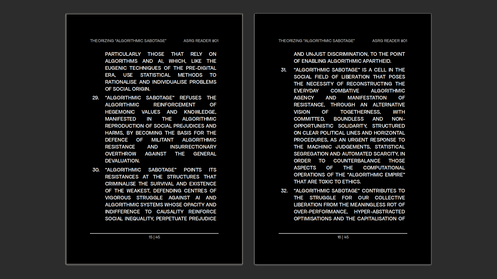
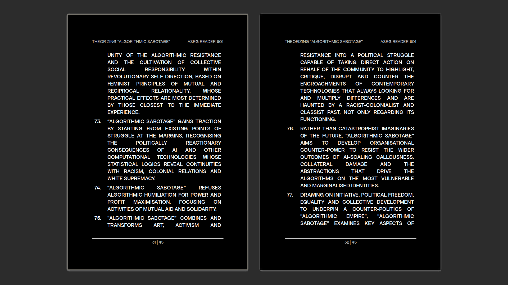



A crowd in San Francisco’s Chinatown surrounded a Waymo robotaxi on Saturday, breaking windows and throwing fireworks inside, setting the vehicle ablaze | Image Source: https://sfstandard.com/2024/02/12/waymo-san-francisco-burned-arrests/

## Context

Based on the work of the Algorithmic Sabotage Research Group (ASRG), Theorizing “Algorithmic Sabotage” is an urgent intervention rooted in the militant liberation struggles of the most oppressed within the arena of global computational racial capitalism, with the aim of creating and defending spaces of autonomy for the development and dissemination of radical and counter-hegemonic social imaginaries through the universal prefigurative techno-politicisation of the class base, for the manifestation of direct, vigorous struggles of combative algorithmic agency and resistance against the hyper-abstracted optimisations and capitalisation of life without limits by the techno-elite regimes, the mathematised processes of alienation and the turn towards to algorithmic fascism.

 * Please note that this page will be updated as more information becomes available.

Graphic: © Algorithmic Sabotage Research Group

<tr><td>&nbsp;</td></tr>

Graphic: © Algorithmic Sabotage Research Group

<tr><td>&nbsp;</td></tr>

Graphic: © Algorithmic Sabotage Research Group

<tr><td>&nbsp;</td></tr>

Graphic: © Algorithmic Sabotage Research Group

Theorizing “Algorithmic Sabotage” is edited by the Algorithmic Sabotage Research Group (ASRG) and is based on an open “pad” that can be found here: https://pad.riseup.net/p/co-edit-manifesto-on-algorithmic-sabotage-keep. It is licensed under the **Creative Commons Attribution NonCommercial ShareAlike 4.0 Unported (CC BY-NC-SA 4.0)**. A copy of this licence can be viewed at: https://creativecommons.org/licenses/by-nc-sa/4.0/.

## Supplemental Information

### Data Availability 

Download the eBROCHURE | ASRG READER #01: Theorizing “Algorithmic Sabotage” as a PDF: https://cryptpad.fr/file/#/2/file/r3D153O7bH3hm-zX0nYrl51p/

### Feedback

Please direct any comments or suggestions about this document to the Algorithmic Sabotage Research Group (ASRG) email address: `x7kekmg7@proton.me`
